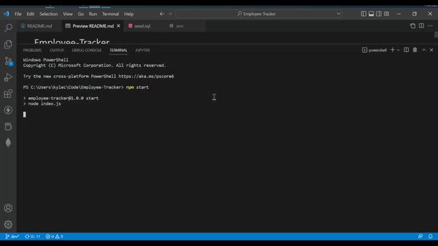

# Employee-Tracker
> Manage your employees, departments, and roles within an organization.

<div id="top"></div>

<!-- TABLE OF CONTENTS -->
<details>
  <summary>Table of Contents</summary>
  <ol>
    <li>
      <a href="#about-the-project">About The Project</a>
      <ul>
        <li><a href="#technologies-used">Technologies Used</a></li>
      </ul>
    </li>
    <li><a href="#installation">Installation</a></li>
    <li><a href="#usage">Usage</a></li>
    <li><a href="#contributors">Contributors</a></li>
  </ol>
</details>


<!-- ABOUT THE PROJECT -->
## About The Project
Keeping track of all the departments, roles, and employees within an organization can be difficult. The employee tracker simplifies the entire process into a single application.

<p align="right">(<a href="#top">back to top</a>)</p>

### Technologies Used

* [Node.js](https://nodejs.org/en/)
* [mySQL](https://mysql.com/)
* [Inquirer](https://github.com/SBoudrias/Inquirer.js#readme)
* [Console Table](https://github.com/bahmutov/console.table#readme)

<p align="right">(<a href="#top">back to top</a>)</p>

## Installation

1. Properly install and configure mySQL.
    See the [mySQL Installation Guide](https://dev.mysql.com/doc/mysql-installation-excerpt/5.7/en/) for installation help.
2. Clone the repo
   ```sh
   git clone https://github.com/kwlucas/Employee-Tracker.git
   ```
3. Install NPM packages
   ```sh
   npm install
   ```
4. Configure the user and password fields for "connection.js" file within the "db" directory
   ```js
   user: "yourUserHere", //your SQL user (use 'root' if you are not sure of another user you can use)
   password: "yourPasswordHere", //The password for your SQL user
   ```
5. Use mySQL to run the "schema.sql" file within the "db" directory
   ```sh
   mysql> SOURCE ./db/schema.sql;
   ```
<p align="right">(<a href="#top">back to top</a>)</p>


<!-- USAGE EXAMPLES -->
## Usage

Run ```npm start``` in the console to start the application.

Select an option displayed in the console.

Selecting "View all departments/roles/employees" will display all the items of the selected type.

When you select "View all employees" You are prompted to select them by id, department, or manager. This will decide how the results will be sorted.



When you select "Add a department" the app will prompt you for the name of the new department before adding it to the data.

When you select "Add a role" you will be prompted for the name, salary, and department of the new role. Once you have entered all the reponses the new role will be added to the data.

When you select "Add an employee" the app will prompt you for the first name, last name, role, and manager of the new employee befire adding the employee to the data.


When you select "Remove a department/role/employee" the app will give you a list of all the existing items of that type. After you select an item it will be removed from the data.

When you select "Update an employee's role" you will be prompted to choose an existing employee. Once selected you are then prompted to select a role. Once done the employee's role is changed.

When you select "Update an employee's manager" you will be prompted to choose an existing employee. Once selected you are then prompted to select another employee to set as their new manager. Once done the employee's manager is changed.


<p align="right">(<a href="#top">back to top</a>)</p>


<!-- CONTACT -->
## Contributors

* [Kyle Lucas](https://github.com/kwlucas)

Project link: [Repository](https://github.com/kwlucas/Employee-Tracker)

<p align="right">(<a href="#top">back to top</a>)</p>
